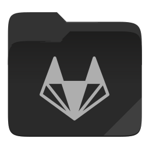
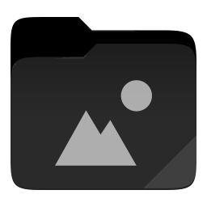
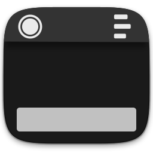
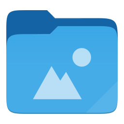
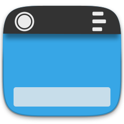

<h1>Suru++ Folders</h1>

- [Description](#description)
- [Installation](#installation)
  - [Independent distribution](#independent-distribution)
    - [Installing](#installing)
    - [Uninstalling](#uninstalling)
  - [Arch-based distributions](#arch-based-distributions)
  - [Debian-based distributions](#debian-based-distributions)
- [Changing the colour of folders](#changing-the-colour-of-folders)
  - [Important advice!](#important-advice)
  - [Available colours](#available-colours)
- [Licence](#licence)

# Description

The file `suru-plus-folders` is a bash script that allows changing the color of folders in [Suru++ 20 icons theme](https://github.com/suru-plus/suru-plus), based on the forks of icons of folders of Papirus.

At the moment `suru-plus-folders` doesn't have a GUI, but it is a fully functional command-line application. Before seeing the examples of use, please install firstly:

# Installation

## Independent distribution

Use the script to install the latest version directly from this repository (independently on your distro):

### Installing

```
wget -qO- https://git.io/fhQdI | sh
```

To install `suru-plus-folders` on **BSD systems** using the following command:

```
wget -qO- https://git.io/fhQdI | env PREFIX=/usr/local sh
```

### Uninstalling

```
wget -qO- https://git.io/fhQdI | env uninstall=true sh
```

## Arch-based distributions

Soon

## Debian-based distributions

Soon

# Changing the colour of folders

Some examples of use:

- Showing the current color and available colors for Suru++:
    ```
    suru-plus-folders -l --theme Suru++
    ```
- Changing colour of folders to brown for Suru++:
    ```
    suru-plus-folders -C brown --theme Suru++
    ```
- Revert to default color of folders for places of Suru++:
    ```
    suru-plus-folders -D --theme Suru++
    ```
- Restore the last used color from a config file:
    ```
    suru-plus-folders -Ru
    ```

## Important advice!

This is extremely useful for restoring colour after each icons theme upgrade (official installers of [Suru++](https://github.com/suru-plus/suru-plus) and some third-party packages do this automatically).

**NOTE:** To change the colour of an individual folder you can use [Folder Color](http://foldercolor.tuxfamily.org) or [Dolphin Folder Color](https://github.com/audoban/dolphin-folder-color).

## Available colours

<table style="margin-left: auto; margin-right: auto;">
  <thead>
    <tr>
      <th style="text-align:left">Name</th>
      <th style="text-align:center">Preview</th>
    </tr>
  </thead>
  <tbody>
    <tr>
      <th>black</th>
      <td>
        
        
        
        
        
        
        
        
         
         
        
      </td>
    </tr>
    <tr>
      <th>blue</th>
      <td>
        
        
        
        
        
        
        
        
         
         
        
      </td>
    </tr>
  </tbody>
</table>

**NOTE:** This project doesn't provide any folder icons. If you want to request a new folder icon or a new color of folder, please open an issue and make a request [here](https://github.com/suru-plus/suru-plus/issues/new).

# Licence

MIT © 2017 [Papirus Folders](https://github.com/PapirusDevelopmentTeam/papirus-folders) by [Sergei Eremenko](https://github.com/SmartFinn)
